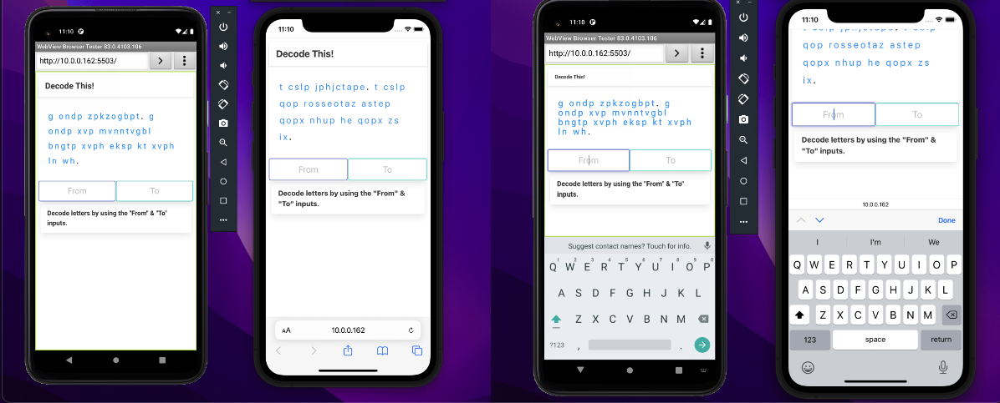

 

  
<h3 align="center">Decode This!</h3>

  

    <strong>A Front End Web App Cryptogram Game</strong>
     
     
    <a href="https://decodethis.app/">Play the Game</a>
    ·
    <a href="https://github.com/ReadingTheDocumentation/DecodeThis/issues">Report Bug</a>
    ·
    <a href="https://github.com/ReadingTheDocumentation/DecodeThis/issues">Request Feature</a>
  

 

  

  
Table of Contents

  <ol>
    <li>
      <a href="#about">About</a>
      <ul>
        <li><a href="#built-with">Built With</a></li>
      </ul>
    </li>
    <li>
      <a href="#the-game">Game Design</a>
      <ul>
        <li><a href="#howto">How to Decode a Quote</a></li>
        <li><a href="#tips">Tips</a></li>
      </ul>
    </li>
    <li>
      <a href="#hurdles">Biggest Hurdles</a>
      <ul>
        <li><a href="#viewport">Android Viewport Issue</a></li>
        <li><a href="#iOSScroll">iOS Scroll on Focus Issue</a></li>
      </ul>
    </li>
    <li><a href="#codereview">First Code Review</a></li>
    <li><a href="#roadmap">Roadmap</a></li>
    <li><a href="#credits">Credits</a></li>
  </ol>

  
### About
  
A short while back, I quit my advertising job to teach myself how to program using [Colt Steele's Udemy Course](https://www.udemy.com/course/the-web-developer-bootcamp/). I
ended up enjoying it, and I signed for the Hack Reactor Prep Course and Pre Course. I didn't end up doing the
Bootcamp and instead went back to the Udemy course as it was more my learning style. Upon reaching the NodeJS point
in Colt's course, I decided I needed to put my new skill to the test and build something from scratch.  

Around this time, Wordle hit it huge! My father suggested [Decodaquote](https://decodaquote.com/) -- a word cryptogram game that he did daily in the newspaper before work. I thought this would be a good test of my skills - coding something from nearly scratch.  

While it's just a few hundred lines of code, it was a lot of work. I feel like I learned so much I'm excited to continue learning Javascript. I already have an idea for my next app - hopefully built in Vue or React.  

### Built With
- [Javascript](https://www.ecma-international.org/publications-and-standards/standards/ecma-262/)  
- [Bulma](bulma.io)  
- [Axios](https://axios-http.com/docs/intro)  
- [Quotable](https://github.com/lukePeavey/quotable)  

### Game Design  

Decode this is an encryption game. Your goal is to decode a quote from a free API of inspirational quotes.  

All of the letters in the quote have been switched with another random letter -- for example all of the "l"s in the example below have been changed for "e"s.  

>Hello World
>
>Ndeeq Sqpez

### How to Decode a Quote  

It's a trial and error process -- use the 'from' and 'to' boxes to swap out a letter that you think may move you toward a solution.  

If you make a mistake, click the incorrect letter to revert it to the original encoded letter.  

### Tips  

The most common letters in the English Alphabet are e, t, a, i, o, n, s, h, and r.  

Single-letter words are always "I" or "A".  

After that, if you get stuck, remember that "the" is the most common three-letter word in English.  

Other common three-letter words are: and, are, for, not, but, had, has, was, all, any, one, man, out, you, his, her, & can.  

If the second to last character of a word is an apostrophe, then the word likely ends with a "T" or "S," but sometimes a "D."  

### Biggest Hurdles  

I built the app using Chrome Development tools to see how the app would look on a mobile phone. Everything looked great until I pushed the app to Github Pages and opened them on an Android and iPhone app. I quickly learned that testing them on my phone after pushing to Github was a fool's errand. So I installed Xcode Tools and Android Studio to troubleshoot my two most significant issues.  

The iOS and Andoird both handle the keyboard opening differently, as you can see in the image below.  

  

### Android Viewport Issue  

Looking at the picture above, you can see the before and after keyboard opened and keyboard closed. The text "squishes" whenever a focus event fires on an input. After doing some digging, I realized that when the keyboard opens, it changes the viewport size on android devices, and because I'd used relative length units to determine the front-size of the encoded quote characters, line-height, and letter-spacing. I was able to find code on [StackOverflow](https://stackoverflow.com/a/62054041/17197174) that solved this issue with just a few lines of code.  

### iOS Scroll on Focus Issue  

Much more challenging to work with was iOS. Rather than shrinking the viewport when a focus event fires on an input, iOS will scroll the entire webpage up to center the input on the screen, cutting off the top half of the quote. It took me a long time to develop the vocabulary I needed to search for a solution. Still, eventually, I found my way to a StackOverflow answer that had a solution in JQuery. I took a few minutes, translated it to Vanilla JS, and [responded to the question with my version](https://stackoverflow.com/a/70857776/17197174). It also solved the auto-scroll on input focus issue, but it's a bit hacky. If you know of a better solution to this, I'd love to know about it to clean up a big chunk of my code.  

### First Code Review  

I initially wrote the code across several files that looked back at a new Class created when the dom loaded, and the API request fired. I had a JS file for all user inputs, one for rendering modals, and a couple of others that, looking back, didn't make a lot of sense.  

After getting the app fully functional, I quickly realized that there was no good way to write tests in Mocha for the app. As this is one of my first projects, the goal was to have a total Mocha Test Suite prospective employers could look at it. Enter TIGR  

-TIGR
    - A close friend of mine who works in biotech told me about his team's term TIGR or Test Induced Greater Refactoring. I ended up moving nearly the entire app into a single class that's created upon an API call -- now I can write a test that makes a version of the app by creating a new course with know data.  

-Val Reviews Code
    - Luckily my sister is a fantastic coder and lives nearby. I asked her for a code review, and we did a deep dive into the code. You can take a look at it here. A lot of it came down to patterns - making my code more self-documenting and adding in patterns the like using the escape key to close a modal. I can't understate how helpful this code review was for my troubleshooting. Naming conventions and patterns are EVERYTHING.   

### Road Map  

- Test Suite: as mentioned above, I need to finish out the test suite. I also need to do more research about creating tests as I develop.  
- Dark Mode: There is a way to do Bulma in DarkMode, but it requires Sass. Unfortunately, I haven't found a CDN for Node Sass, so I'm not sure when this will come, but I'm about to start learning Node, so hopefully soon.  
- Streaks: I want a way to share how many quotes you've decoded, and you can see a streak. However, my skills aren't there yet.  
- Daily: I'd also like everyone to get the exact quote, much like everyone gets the same word on Wordle  

### Credits  

- Thanks to PY & NF for the idea and inspiration and design help.

- Thanks to VY for all her help and code review.

- Thanks to my friend CB for his encouragement and for teaching me the TIGR method.

- Thanks to Favicon Credit to Freepik - Flaticon